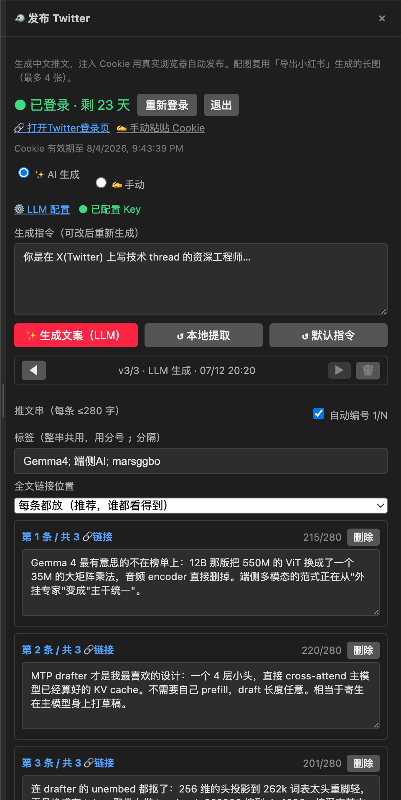
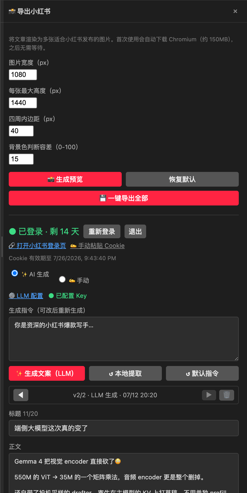

# Markdown2Anything

> **一篇 Markdown，一键发到所有平台。**
> 微信公众号 · 知乎 · 小红书 · Twitter(X) —— 排版、配图、文案、发布，全自动。

写完一篇技术博客，最烦的从来不是写作本身，而是后面那一堆**重复劳动**：

- 复制到微信 → 排版全乱、公式变乱码、代码高亮丢失
- 复制到知乎 → 图片要一张张重传
- 发小红书 → 得先把文章截成图，再手动拖进去，还要另写一份标题/正文/标签
- 发 Twitter → 又要重写一遍，还得拆成串推，图还得再传一次

**Markdown2Anything 把这些全干掉。** 一篇 `.md`，一个面板，四个平台。



---

## ✨ 核心能力

| 平台 | 能做什么 |
|------|---------|
| 🐧 **微信公众号** | 一键复制带内联样式的 HTML（公式转 SVG、代码高亮保留），或直接上传草稿箱 |
| 📝 **知乎** | 自动打开编辑器，**自动填标题 + 正文 + 代码块（带语言高亮）+ 公式**；图片需手动粘贴（见下） |
| 📱 **小红书** | 文章**自动截成长图** → **AI 写标题/正文/标签** → **注入 Cookie 自动传图填字** |
| 🐦 **Twitter (X)** | AI 生成**中文串推（thread）**，图片按顺序切块配到各条，自动填好 |
| 🖼️ **预览区图片** | 鼠标悬停即可**「复制图片」**（复制的是真 PNG 位图），粘到任意平台会被自动上传 |

### 🤖 AI 文案生成（可选）

- 接**任意 OpenAI 兼容接口**（DeepSeek / OpenRouter / Groq / 本地 Ollama / OpenAI…），面板里一键预设
- **不配 Key 也能用**：内置**本地关键词提取算法**（中英混合 n-gram + 停用词过滤 + 长词吸收短词），零成本自动生成标题/正文/标签
- **Prompt 可编辑**，不满意随时改了重新生成
- **版本管理**：每次生成存一版，`◀ ▶` 左右切换对比，`🗑` 单独删除，旧版本永不自动丢失

### 🔐 安全设计

- **API Key 存进系统钥匙串**（VS Code SecretStorage），不落明文、不进 Settings Sync、不会被误提交进 git
- **Cookie 只存本地**（globalState），唯一网络去向是平台自己，**不经过任何第三方服务**
- 发布走 **Playwright 真实浏览器 + Cookie 注入**（模拟真人操作），而不是伪造签名的 HTTP 请求
- 默认**不替你点最后那下「发布」**——内容和图都自动填好后停下，你核对无误再自己点

### 🎨 其它

10 套内置主题 · LaTeX 公式（KaTeX） · 实时预览 · 在线改 CSS · 目录导航 · 图片自动转 Base64（无需图床） · 导出 HTML

---

## 📸 效果预览

| 小红书：长图 + AI 文案 + 自动发布 | Twitter：AI 串推 + 分条预览 + 版本切换 |
|:---:|:---:|
|  |  |

---

## 🚀 安装

### VS Code 扩展市场（推荐）

在 VS Code 扩展面板搜索 **`Markdown2Anything`** 安装。

### 从源码安装

```bash
git clone https://github.com/marsggbo/markdown2anything.git
cd markdown2anything
npm install
npm run install-ext      # 打包并安装到本地 VS Code
```

### 开发模式

```bash
npm install
# 用 VS Code 打开本目录，按 F5 启动调试
```

> 首次使用截图/发布功能时会**自动下载 Chromium**（约 150MB），之后无需等待。

---

## 📖 快速开始

打开任意 `.md` 文件，按 `Cmd/Ctrl + Shift + W` 打开预览面板。

### 发小红书

1. 点 **📸 导出小红书** → **💾 一键导出全部**（文章自动截成多张长图）
2. 下方文案区：点 **✨ 生成文案（LLM）**，或直接用本地算法预填好的内容
3. 首次点 **登录小红书** → 弹出浏览器扫码 → Cookie 自动存好（面板显示有效期倒计时）
4. 点 **🚀 发布小红书** → 浏览器自动打开、自动传图、自动填标题/正文/标签
5. **你核对一眼，点页面上的「发布」** —— 完成

### 发 Twitter

1. 点 **🐦 发布 Twitter**
2. 点 **✨ 生成文案** —— AI 会根据长图张数**自动决定串推条数**（`条数 = ⌈图片数 ÷ 4⌉`），
   并让**每条推文讲的就是它配的那几张图里的内容**
3. 登录 → 发布 → 浏览器里自动填好整串 + 按顺序配图 → 你点「发帖」

> 💡 每条推文的字数按 **X 的加权规则**实时计算（**中文算 2 个字符**，链接固定算 23），超限会标红并在发布前拦下。

### 发知乎

1. 扫码登录一次
2. 点 **🚀 发布知乎** → 浏览器自动打开编辑器，**标题、正文、代码块（带语言高亮）、公式全部自动填好**
3. **图片需要手动补**：回到预览区，鼠标移到图片上 → 点 **「📋 复制图片」** → 到知乎编辑器里 `Cmd/Ctrl + V`

> ⚠️ **为什么图片要手动？**
> 知乎编辑器**不会**自动抓取粘贴进来的图片（无论是 base64 还是远程 URL 都不行），
> 只有**剪贴板里是真正的图片位图**时它才会上传到自己的图床。
> 所以插件提供了「📋 复制图片」按钮——它复制的正是**真 PNG 位图**，
> 粘进去知乎就会自动上传，不用再去文件夹里翻文件、走上传对话框。

---

## ⚙️ 配置

| 配置项 | 说明 |
|--------|------|
| `markdown2anything.llm.baseUrl` | LLM 接口地址（OpenAI 兼容），如 `https://api.deepseek.com/v1` |
| `markdown2anything.llm.model` | 模型名，如 `deepseek-chat` |
| **API Key** | **不在设置里** —— 在面板的「⚙️ LLM 配置」里填，存进系统钥匙串 |
| `markdown2anything.publish.mode` | `prepare`（默认）填好后停下由你点发布 / `auto` 全自动 |
| `markdown2anything.publish.headless` | 是否隐藏发布时的浏览器窗口 |
| `markdown2anything.appid` / `.appSecret` | 微信公众号草稿箱上传（经 FastPen 服务） |

**LLM 预设**（面板下拉一键填好）：

| 预设 | 是否免费 |
|------|---------|
| **本地 Ollama** | ✅ 完全免费、无需 Key、数据不出本机 |
| OpenRouter | 带 `:free` 后缀的模型免费（需注册免费 Key） |
| Groq | 有免费额度（需注册免费 Key） |
| DeepSeek | 付费但很便宜，中文文案质量好 |

---

## 📁 文件产物

```
your-post/
  my-article.md
  my-article_xhs/            ← 自动生成的长图
    xhs_01.png …
  my-article_social.json     ← 文案 + 版本历史（可随文章一起 git 备份）
```

`_social.json` 保存了每个平台的**全部生成版本**（含来源和时间戳），换台机器、重开面板都不用重新生成。

---

## 🧭 工作原理

```
Markdown
  ├─ marked + KaTeX + highlight.js  → HTML
  ├─ juice                          → 内联样式（微信/知乎才认）
  ├─ Playwright                     → 滚动截图 + 智能分片（在空白行处切）→ 长图
  ├─ LLM（OpenAI 兼容）             → 平台化文案（标题/正文/标签/串推）
  └─ Playwright + Cookie 注入       → 真实浏览器自动填内容 + 传图 → 你点发布
```

**为什么用真实浏览器，而不是调 API？**

小红书没有公开的发布 API；X 的 API 自 2026 年 2 月起改为按次付费（**带链接的推文 $0.20/条**）。
用 Cookie 注入真实浏览器、走正常 UI 流程，既免费，也比伪造签名的 HTTP 请求更不容易触发风控。

---

## 📂 项目结构

```
extension.js              VS Code 扩展主入口 + 预览面板 UI
lib/
  converter.js            Markdown → HTML（公式 / 代码 / 图片处理）
  themes.js               10 套主题
  zhihu.js                知乎登录 + 图片上传 + 发布
  llm.js                  LLM 文案生成（OpenAI 兼容）
  extract.js              本地关键词提取（不依赖大模型）
  social.js               Cookie 管理 + 发布调度
scripts/
  xhs_screenshot.js       Playwright 长图截图 + 智能分片
  social_worker.js        Playwright 发布 worker（小红书 / Twitter）
  zhihu_login.js          知乎扫码登录
electron/                 独立桌面客户端（可选，不依赖 VS Code）
templates/                自定义导出模板
```

---

## ⌨️ CLI / Agent Skill

同一套能力也有**命令行版**，核心逻辑完全复用（不是另写一份）：

```bash
npm link ./cli

md2any login xhs
md2any images ./post.md
md2any gen ./post.md --to twitter
md2any publish ./post.md --to xhs,twitter
```

**stdout 只出结果、stderr 出日志、`--json` 给结构化输出** —— 为脚本和 Agent 设计。
仓库里的 [`cli/SKILL.md`](./cli/SKILL.md) 是给 Agent 读的 skill 定义：把 `cli/` 挂进 Claude Code / OpenClaw 之类的 Agent，它就能听懂「把这篇文章发到小红书和推特」。

详见 [cli/README.md](./cli/README.md)。

---

## 🖥 独立桌面客户端

不装 VS Code 也能用：

```bash
npm install
npm run start:electron     # 直接运行
npm run build:mac          # 打包成 macOS DMG
```

---

## 📜 更新日志

### v2.8.x — 知乎重做 + 预览区图片可复制
- **知乎发布重做**：改走真实浏览器（知乎没有公开 API，且会主动改内部接口搞挂第三方工具）
  - 修复**代码块语言被错识别成 `hljs`** 的 bug —— 这导致知乎既不高亮、也不当代码块处理（换行全丢、折叠成一行）
  - 发布用的 HTML 从**258KB 的带样式文档**换成 **463 字节的干净语义 HTML**（之前被知乎的过滤器洗坏）
  - 公式改用知乎原生的 `eeimg` 格式
  - ⚠️ **图片仍需手动粘贴**（知乎不会自动抓取粘贴进来的图片，见上文说明）
- **预览区图片可选中/复制**：悬停即可「📋 复制图片」（复制的是真 PNG 位图，粘到任意平台会被自动上传）

### v2.7.x — 社交平台自动发布
- **新增 Twitter(X) 发布**：AI 生成中文串推、按图切块配图、X 加权字数（中文=2）实时校验
- **新增小红书自动发布**：Cookie 注入真实浏览器，自动传图 + 填标题/正文/标签
- **新增 AI 文案生成**：任意 OpenAI 兼容接口 + 可编辑 Prompt + **本地关键词提取兜底**（无需 Key）
- **新增版本管理**：每次生成存一版，左右切换对比、单独删除，落盘到 `_social.json`
- **安全加固**：API Key 改存系统钥匙串（SecretStorage）；Cookie 仅存本地，不经第三方
- **体验**：登录态有效期倒计时、发布进度条、断点续传、全局复用单个浏览器窗口

### v2.0.x — 基础能力
- 微信 / 知乎 / 小红书导出与发布，10 套主题，LaTeX 公式，Playwright 截图，微信草稿箱上传

---

## 📄 许可证

MIT © [marsggbo](https://github.com/marsggbo)

## 🙏 致谢

[marked](https://github.com/markedjs/marked) · [KaTeX](https://katex.org/) · [juice](https://github.com/Automattic/juice) · [Playwright](https://playwright.dev/) · [highlight.js](https://highlightjs.org/)
